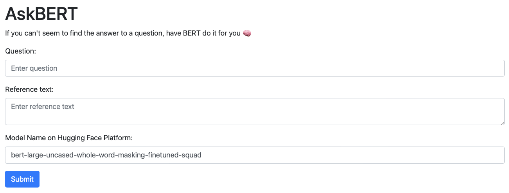

# SQuAD Made Easy
This is a script that you can use to:
- Evaluate a BERT model of your choice on any SQuAD format dataset using the official evaluation script.
- Generate predictions with your model for the official SQuAD 2.0 dev set in the correct format for submission to the [SQuAD 2.0 leaderboard](https://rajpurkar.github.io/SQuAD-explorer/).
- Generate predictions with your model for any SQuAD format dataset.

To use your own model, you need to upload it to the Hugging Face model hub. You can find more information about how to do this [here](https://huggingface.co/transformers/model_sharing.html).


## What is SQuAD 2.0?
The Stanford Question Answering Dataset (SQuAD) is a reading comprehension dataset, consisting of questions posed by crowdworkers on a set of Wikipedia articles, where the answer to every question is a segment of text, or span, from the corresponding reading passage, or the question might be unanswerable. SQuAD 2.0 is an extension of SQuAD 1.1, with the addition of approximately 50,000 new, unanswerable questions written adversarially by crowdworkers to look similar to answerable ones. To do well on SQuAD, systems must not only answer questions when possible, but also determine when no answer is supported by the paragraph and abstain from answering.


## What is BERT?
BERT (Bidirectional Encoder Representations from Transformers) is a method of pre-training language representations, meaning that we train a general-purpose "language understanding" model on a large text corpus (like Wikipedia) and then use that model for downstream NLP tasks. BERT was created and published in
2018 by Jacob Devlin and his colleagues from Google. BERT is conceptually simple and empirically powerful. It obtains new state-of-the-art results on eleven natural language processing tasks, including pushing the GLUE score to 80.5% (7.7% point absolute improvement), MultiNLI accuracy to 86.7 (4.6% absolute improvement), SQuAD v1.1 question answering Test F1 to 93.2 (1.5% absolute improvement) and SQuAD v2.0 Test F1 to 83.1 (5.1% absolute improvement).

## Installation

To use the script, you need to have Python 3 and pip installed on your system. Then, run the following command to install the required packages:

```
pip install -r requirements.txt
```

## Usage

To run the script, you will need to provide the following input arguments:

- `--model_name`: The name of the model from the Hugging Face transformers library to use for prediction. This argument is optional and defaults to `bert-large-uncased-whole-word-masking-finetuned-squad`.
- `--use_classifier`: Whether to use the additional unanswerable classifier or not. This argument is optional and defaults to `False`.
- `--input_file`: The path to the input JSON file containing the test data. This argument is optional and defaults to `data/dev-v2.0.json`.
- `--output_file`: The path to save the output JSON file with the predictions to. This argument is optional and defaults to `predictions.json`.
- `--eval_file`: The path to save the JSON file with the evaluation results to. This argument is optional and defaults to `eval_result.json`.

To run the script using the default arguments, you can use the following command:
```
python main.py
```
To specify different values for the arguments, you can use the -- prefix before the argument name, followed by the value you want to use, like this:
```
python main.py --model_name bert-base-uncased --use_classifier True --input_file data/train-v2.0.json --output_file predictions.json --eval_file eval_result.json
```
After the script has finished running, the predictions will be saved in the output_file specified by the --output_file argument. The evaluation results will be saved in the eval_file specified by the --eval_file argument.

# BONUS - [AskBERT Web App](https://github.com/alpayariyak/askBERT-app)

Using my code from this project, I created a simple web app that uses a BERT model of your choice to answer questions based on a reference text:


